 

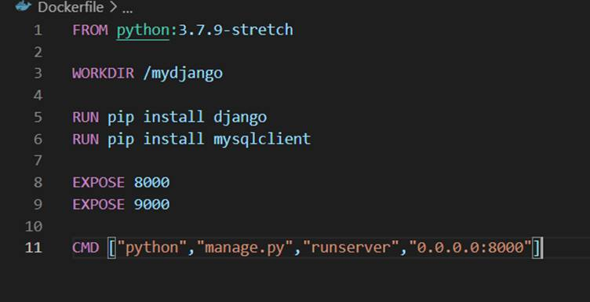

하나 더 열어놓는다고 가정

 

**docker run -P -v C:\Users\MIN\django_project\weather_linking\mysite2:/mydjango -it mydjango**

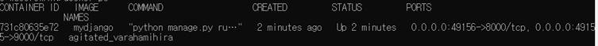

랜덤으로 포트가 부여됨

커맨드와 이미지 사이에 옵션을 넣어야한다. 옵션 내에서 옵션의 순서는 상관없음

http://127.0.0.1:49156/bookmark/

여기로 들어가야됨

혹시 8000번으로 가고싶으면 -P대신 -p 로 바꿔주기

 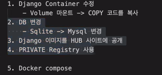


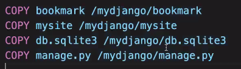

현재 디렉토리에 있는 도커파일

tree 를 사용하면 데이터 볼 수 있음

C:.
├─bookmark
│  ├─migrations
│  │  └─__pycache__
│  ├─templates
│  │  └─bookmark
│  └─__pycache__
└─mysite2
    └─__pycache__

이런식으로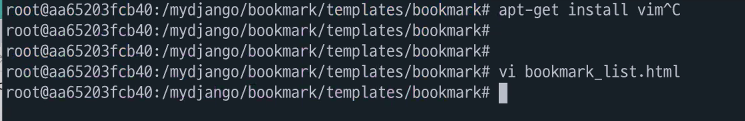

볼륨마운트가 아니라 copy 가 되어있을때는 도커 안으로 들어가서 수정해야 한다

docker exec -it <container id> /bin/bash로 루트로 들어간다

cd ./bookmark/templates/bookmark/ 작업 디렉토리로 이동

ls -al 리스트 확인

apt-get update 업데이트 시켜주고

apt-get install vim vi를 봐야되니 다운받는다

 vi bookmark_list.html 하면 내부의 북마크 리스트를 볼 수 있다

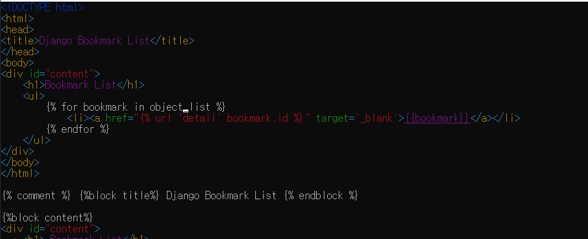

글자 출력 시 x누르면 지워진다

숫자 맞춰서 지울땐(10글자 지우기)-> 10x 누르면 10글자 지워진다

작성 시 i를 눌러 insert모드로 바꾼 뒤 작성

:wq! 를 통해 저장하고 나옵시다


프로세스가 종료되면 컨테이너도 종료된다!

서버 종료시키면 컨테이너도 종료된다...

run 하면 새로운 컨테이너가 만들어지게 된다

다시 띄울때 

start <container id> 

하면 다시 돌아간다

새로운 컨테이너 만들 때마다 vim 깔고...귀찮다.

도커는 완성된것만 배포해야한다

그래서 도커파일에

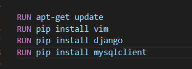

이렇게 추가!

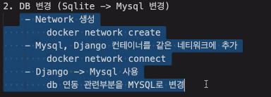


docker run 13306:3306 -e MYSQL_ROOT_PASSWORD=12
34 -v C:\Users\MIN\django_project\weather_linking\mysite2/mysql --network my-network --name mysql_server mysql5.7

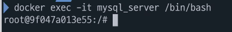


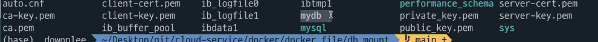

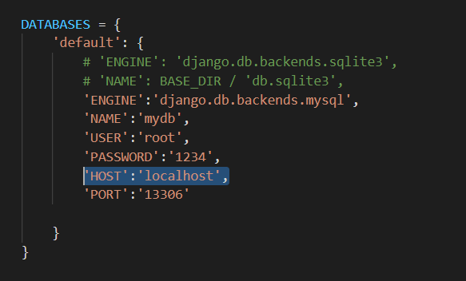

```cmd
mysql -u root -p
```

---------

컨테이너에서 컨테이너로 넘어가는 작업

왼쪽에 있는 장고에서 mysql 컨테이너로 넘어갈 수 있다


docker build -t mydjango:mysql .

다시 빌드


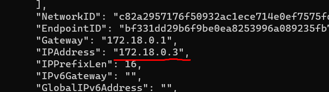


웬만하면 name 쓰자..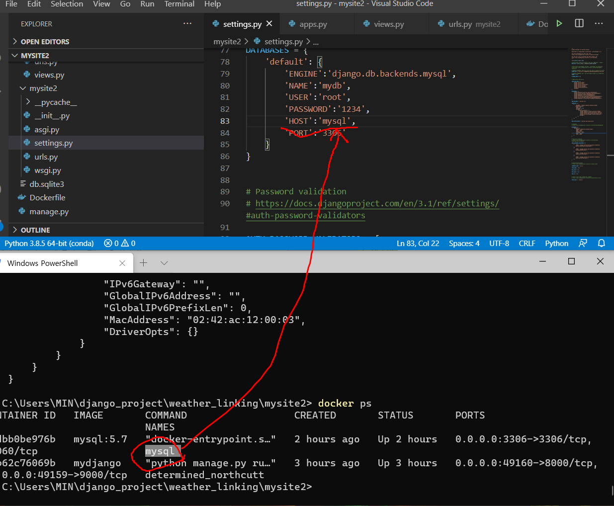

docker run -d -p 8000:8000 mydjango:mysql

볼륨마운트 안걸어놓고 카피만 해둔것이니 볼륨마운트 없이 진행하자

 Id CommandLine
-- -----------
   1 docker exec -it mydjango /bin/bash
   2 docker ps
   3 docker exec -it cdb6 /bin/bash
   4 docker network ls
   5 docker network create my-network
   6 docker network connect my-network mysql
   7 docker run mysql
   8 docker run -it MYSQL_ROOT_PASSWORD=1234 mysql
   9 docker run MYSQL_ROOT_PASSWORD=1234 -it mysql
  10 docker run -d -p MYSQL_ROOT_PASSWORD=1234 -it mysql
  11 docker run -d -p 3306:3306 -e MYSQL_ROOT_PASSWORD=1234 --name mysql mysql:5.7
  12 docker run -d -p 3306:3306 -e MYSQL_ROOT_PASSWORD=1234 --name mysql mysql:5.7
  13 docker network connect my-network mydjango
  14 docker container ls
  15 docker network connect my-network cdb62
  16 docker network inspect my-network
  17 docker network connect my-network mysql
  18 docker network inspect my-network
  19 docker network inspect my-network cdb6
  20 docker network connect my-network cdb6
  21 docker network inspect my-network
  22 docker network ls
  23 docker network inspect my-network
  24 docker network connect my-network mydjango
  25 docker network connect my-network 49160
  26 docker network connect my-network cdb6
  27 docker run MYSQL_ROOT_PASSWORD=1234 -v C:\Users\MIN\django_project\weather_linking\mysite2/mys...
  28 docker run MYSQL_ROOT_PASSWORD=1234 -v C:\Users\MIN\django_project\weather_linking\mysite2/mys...
  29 docker run MYSQL_ROOT_PASSWORD=1234 -v C:\Users\MIN\django_project\weather_linking\mysite2/mys...
  30 docker run 13306:3306 -e MYSQL_ROOT_PASSWORD=1234 -v C:\Users\MIN\django_project\weather_linki...
  31 docker image
  32 docker run 13306:3306 -e MYSQL_ROOT_PASSWORD=1234 -v C:\Users\MIN\django_project\weather_linki...
  33 docker login
  34 docker run 13306:3306 -e MYSQL_ROOT_PASSWORD=1234 -v C:\Users\MIN\django_project\weather_linki...
  35 docker images
  36 docker system prune
  37 docker run 13306:3306 -e MYSQL_ROOT_PASSWORD=1234 -v C:\Users\MIN\django_project\weather_linki...
  38 docker run 3306:3306 -e MYSQL_ROOT_PASSWORD=1234 -v C:\Users\MIN\django_project\weather_linkin...
  39 docker container ls
  40 docer exec -it mysql
  41 docker exec -it mysql
  42 docker exec -it mysql /bin/bash
  43 python manage.py makemigrations
  44 python manage.py makemigrations bookmark
  45 docker exec -it mysql /bin/bash
  46 python manage.py makemigrations
  47 python manage.py makemigrations
  48 python manage.py migrate
  49 python manage.py migrate bookmark
  50 python manage.py makemigrations bookmark
  51 docker images
  52 docker container ls
  53 docker exec -it mysql /bin/bash/
  54 docker exec -it mysql /bin/bash
  55 docker exec -it mysql /bin/bash
  56 docker build -t mydjango:mysql .
  57 docker ps
  58 docker inspect 2cdbb
  59 docker inspect 2cdbb
  60 docker ps
  61 docker ps
  62 mysql -h 127.0.0.1 -P 3306 --user=root --password mydb
  63 docker ps
  64 docker ps -a
  65 clear
  66 docker ps
  67 docker inspect mysql
  68 clear
  69 docker network inspect my-network
  70 clear
  71 docker ps
  72 docker logs fc84c0295f51
  73 docker ps
  74 docker exec -it mysql /bin/bash
  75 docker ps
  76 docker stop fc84
  77 docker rm fc84
  78 clear
  79 type .\Dockerfile
  80 code .
  81 docker build -t mydjango:mysql .
  82 clear
  83 docker run -d -p 8000:8000 --network my-network mydjango:mysql
  84 docker network inspect my-network
  85 clear
  86 docker ps
  87 docker logs a442
  88 docker stop a442
  89 docker rm a442
  90 docker run -d -p 8000:8000 -it --network my-network mydjango:mysql
  91 clear
  92 docker logs 0bfe
  93 history
  94 python manage.py makemigrations
  95 python manage.py migration
  96 python manage.py migrate
  97 python manage.py createsuperuser
  98 docker run -d -p 8000:8000 -it --network my-network mydjango:mysql
  99 docker ps
 100 docker ps
 101 docker logs 0bfe
 102 clear
 103 docker ps -a
 104 docker stop 0bfe
 105 docker ps -a
 106 docker system prune
 107 clear
 108 docker ps -a
 109 docker inspect mysql
 110 clear
 111 docker run -d -p 8000:8000 -it --network my-network mydjango:mysql
 112 docker logs 54899
 113 docker ps -a
 114 docker exec -it 5489944e8a0c
 115 docker exec -it 5489944e8a0c /bin/bash

 118 docker ps
 119 docker tag mydjango:mysql 6democratickim9/mydjango:mysql
 120 docker tag mysql:5.7 6democratickim9/mysql:5.7
 121 docker image push 6democratickim9/mysql:5.7
 122 docker image push 6democratickim9/mydjango:mysql
 123 cd ..
 124 cd ..
 125 mkdir db_project
 126 cd db_project
 127 code Dokerfile
 128 cd ..
 129 mkdir db_project
 130 cd ..
 131 mkdir db_project
 132 cd db_project
 133 code Dokerfile
 134 docker build -t mydb
 135 docker build -t mydb .
 136 docker build -t mydb .
 137 code Dokerfile
 138 docker ps
 139 docker ps
 140 docker stop 913
 141 docker rm 913
 142 ls -l ./db_mount
 143 ls -l
 144 ls
 145 docker build -t mymysql:latest
 146 docker build -t mymysql:latest .
 147 docker pull registry
 148 docker ps
 149 docker stop 5489...
 150 docker pull registry
 151 docker images | grep registry
 152 docker images
 153 docker run -d -p 5000:5000 --restart always --name registry registry
 154 docker ps -a
 155 docker tag 6democratickim9/mymysql:latest localhost:5000/mymysql:latest
 156 翿ㅁㄱ
 157 docker images
 158 docker tag 6democratickim9/mymysql:mysql localhost:5000/mymysql:latest
 159 docker tag 6democratickim9/mymysql:5.7 localhost:5000/mymysql:latest
 160 docker tsg 6democratickim9/mysql:5.7 localhost:5000/mymysql:latest
 161 docker tag 6democratickim9/mysql:5.7 localhost:5000/mymysql:latest
 162 docker tag 6democratickim9/mydjango:mysql localhost:5000/mydjango:latest
 163 clear
 164 docker images
 165 docker ps
 166 docker push localhost:5000/mydjango
 167 docker push localhost:5000/mymysql
 168 curl
 169 curl -X GET http://localhost:5000/v2/_catalog
 170 clear
 171 docker ps

혹시모르니 히스토리 복붙


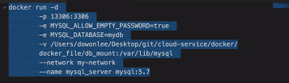

