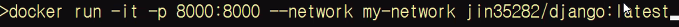

함 다시 해봐야겠다...

docker compose

docker 커맨드나 복잡한 설정을 관리하기 위한 도구

docker-compose up

docker compose down

cmd/entrypoint 의 차이점:

entrypoint는 입력값 변경 어렵지만 cmd는 파라미터 변경가능

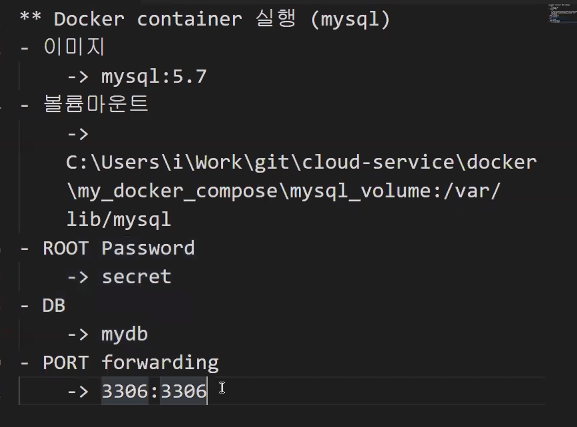

docker run -p 3306:3306 --volume C:\Users\MIN\Desktop\mysql_volume:/var/lib/mysql -e MYSQL_ROOT_PASSWORD=secret -e MYSQL_DATABASE=mydb --name mysql_server mysql:5.7

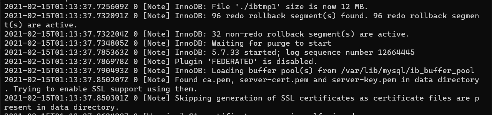detach mode로 실행한게 아니라 로그가 다 보입니당

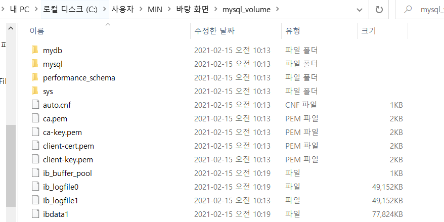

들어오면

db 관련 파일들이 있다

code docker-compose.yml

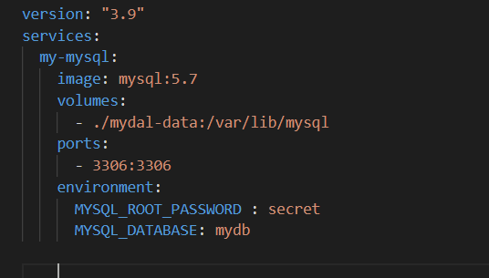

docker-compose up

실행!

자동으로 넘버링된다--> 서비스 하나면 (이름)_1 으로

이제 창을 하나 더 켜서 프로세스가 잘 만들어졌는지 확인!

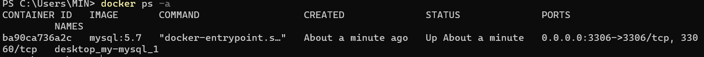

잘 만들어졌음^-^

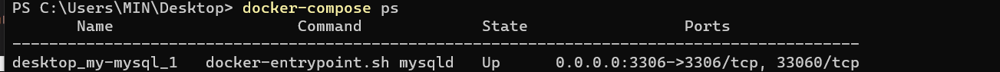

docker-compose ps 하면 하단의 프로세스 볼 수 있음

내 데베 pull 해서

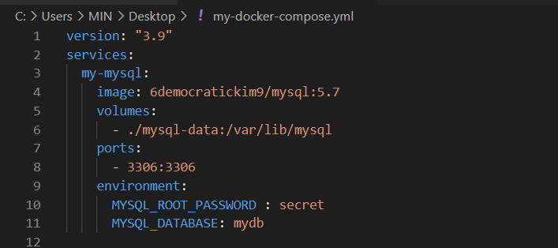

해주고

docker-compose --file my-docker-compose.yml up

해주면

컴포즈가 된다

근데,... 왜pull했던 이미지에서 mydb가 안보이는지 등골이 오싹...

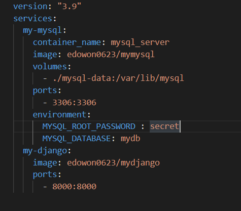

추가!

데이터베이스가 실행된 상태에서 장고를 실행해야 데이터베이스를 가져올 수 있기 때문에 mysql 먼저 실행한다!

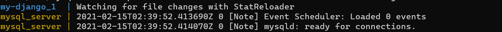

두가지 같이 작동중,,

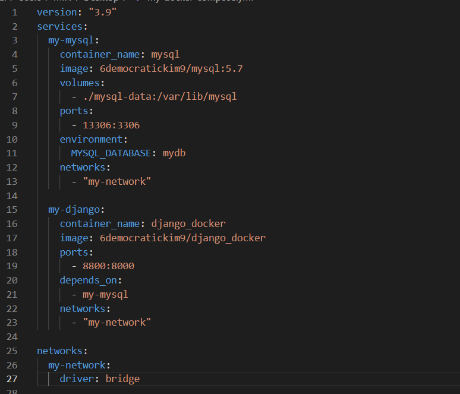

네트워크 묶어주고 실행해본다!

inspect 실행해보면 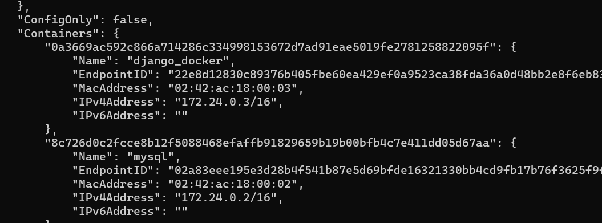

이렇게 묶여있는 것을 확인할 수 있다

지금 뭔가 잘못됐다...이따 해결해야지ㅠ

-------------------------------

히스토리 모아두기

# 1

   1 docker pull mysql:5.7
   2 docker pull mysql
   3 docker pull mysql:5.7
   4 docker ps -a
   5 docker system prune
   6 docker sp
   7 docker run -d -p 3306:3306 -v PS C:\Users\MIN\Desktop:/var/lib/mysql -e MYSQL_ROOT_PASSWORD=se...
   8 docker run -d -p -v PS C:\Users\MIN\Desktop:/var/lib/mysql 3306:3306 -e MYSQL_ROOT_PASSWORD=se...
   9 docker run -v PS C:\Users\MIN\Desktop:/var/lib/mysql 3306:3306 -e MYSQL_ROOT_PASSWORD=secret -...
  10 docker run -d -p 3306:3306 -e MYSQL_ROOT_PASSWORD=secret --name mysql mysql:5.7
  11 mkdir mysql_volume
  12 docker run -p 3306:3306 --volume C:\Users\MIN\Desktop\mysql_volume :/var/lib/mysql -e MYSQL_RO...
  13 docker run -p 3306:3306 --volume C:\Users\MIN\Desktop\mysql_volume:/var/lib/mysql -e MYSQL_ROO...
  14 docker run -p 3306:3306 --volume C:\Users\MIN\Desktop\mysql_volume:/var/lib/mysql -e MYSQL_ROO...
  15 dockr exec -it mysql_server/bin/bash
  16 docker exec -it mysql_server/bin/bash
  17 mysql -u root -p
  18 docker exec -it mysql_server /bin/bash
  19 docker ps -a
  20 docker stop mysql_server
  21 docker rm mysql_server
  22 dir
  23 code docker-compose.yml
  24 docker-compose --version
  25 docker-compose -help
  26 docker-compose up
  27 docker run -d -p 3306:3306 6democratickim9/mysql:5.7
  28 docker logs
  29 docker logs e75a
  30 docker exec -it e75a /bin/bash
  31 docker run -d -p 3306:3306 MYSQL_ROOT_PASSWORD=1234 6democratickim9/mysql:5.7
  32 docker run -d -p MYSQL_ROOT_PASSWORD=1234 3306:3306 6democratickim9/mysql:5.7
  33 docker create network my-network
  34 docker login
  35 docker create network my-network
  36 docker network create my-network
  37 docker run -d -p MYSQL_ROOT_PASSWORD=1234 3306:3306 6democratickim9/mysql:5.7
  38 docker run -d -p ...
  39 docker run -d -p 3306:3306 6democratickim9/mysql:5.7
  40 docker run -p 3306:3306 6democratickim9/mysql:5.7
  41 docker docker run -d -p 3306:3306 -e MYSQL_ROOT_PASSWORD=1234 --name mysql 6democratickim9/mys...
  42 docker run -d -p 3306:3306 -e MYSQL_ROOT_PASSWORD=1234 --name mysql 6democratickim9/mysql:5.7
  43 docker exec -it 9bab /bin/bash
  44 docker pull 6democratickim9/django_docker
  45 docker pull 6democratickim9/mysql:5.7
  46 docker run -p 3306:3306 6democratickim9/mysql:5.7
  47 docker run -p 13306:3306 6democratickim9/mysql:5.7
  48 docker run -p 8800:8000 6democratickim9/django_docker
  49 docker pull edowon0623/mydjango
  50 docker run -p 8000:8000 edowon0623/mydjango
  51 docker ps
  52 docker stop 774
  53 docker rm 774
  54 docker-compose --file my-docker-compose.yml down
  55 docker ps
  56 docker-compose --file my-docker-compose.yml up
  57 docker-compose --file my-docker-compose.yml up
  58 docker ps
  59 docker system prune
  60 docker-compose --file my-docker-compose.yml up
  61 docker ps
  62 docker network inspect my-network
  63 docker network ls
  64 docker network inspect desktop_my-network
  65 docker ps -a
  66 docker exec -it mysql /bin/bash
  67 docker exec -it django_docker /bin/bash
  68 docker network inspect desktop_my-network
  69 docker exec -it django_docker /bin/bash
  70 docker exec -it mysql /bin/bash
  71 docker exec -it mysql /bin/bash
  72 docker run -p 13306:3306 6democratickim9/mysql:5.7
  73 docker network inspect desktop_my-network
  74 docker ps -a
  75 docker exec -it django_docker /bin/bash

--------------------------

# 2  

1 docker ps -a
   2 docker compose ps
   3 docker-compose ps
   4 cd C:\Users\MIN\Desktop
   5 docker-compose ps
   6 dir/w
   7 docker-compose down
   8 docker pull 6democratickim9/mysql:5.7
   9 docker ps
  10 code my-docker-compose.yml
  11 docker-compose --file my-docker-compose.yml up
  12 docker-compose --file my-docker-compose.yml up
  13 docker-compose --file my-docker-compose.yml up
  14 docker ps -a
  15 docker system prune
  16 docker-compose --file my-docker-compose.yml
  17 docker-compose --file my-docker-compose.yml up
  18 docker-compose --file my-docker-compose.yml up
  19 docker-compose --file my-docker-compose.yml up
  20 docker-compose --file my-docker-compose.yml up
  21 docker-compose --file my-docker-compose.yml up
  22 docker-compose --file my-docker-compose.yml up
  23 docker-compose --file my-docker-compose.yml up
  24 docker-compose --file my-docker-compose.yml up
  25 docker-compose --file my-docker-compose.yml up
  26 docker-compose --file my-docker-compose.yml up
  27 docker ps -a
  28 docker system prune
  29 docker network ls
  30 docker-compose --file my-docker-compose.yml up
  31 docker ps -a
  32 docker system prune
  33 docker-compose --file my-docker-compose.yml up
  34 docker-compose --file my-docker-compose.yml up
  35 docker-compose --file my-docker-compose.yml up
  36 cd C:\Users\MIN\django_project\weather_linking
  37 git push origin master
  38 git add .
  39 git commit -m "docker-compose learning"
  40 git push origin mater
  41 git push origin mater
  42 git pull
  43 git add .
  44 git commit -m "??"
  45 git push origin mater
  46 git push origin master
  47 git pull origin master
  48 git push origin master
  49 docker-compose --file my-docker-compose.yml up
  50 docker ps -a
  51 docker system prune
  52 docker-compose --file my-docker-compose.yml up

----------------------------

외..않됄가?

쿠버네티스로 넘어가즈ㅏ..일단..

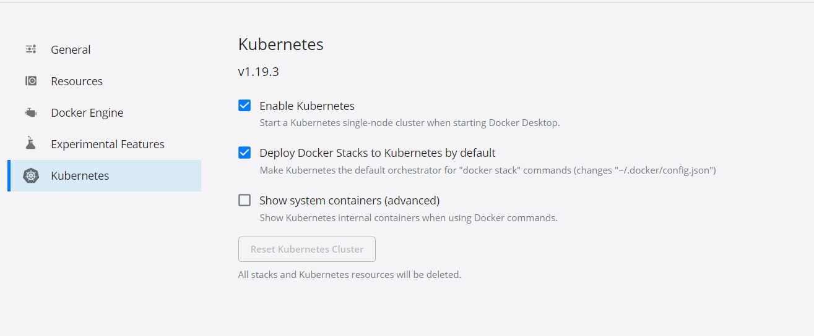

그담에 하단에 있는 apply&restart 누른다

