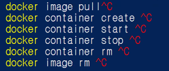
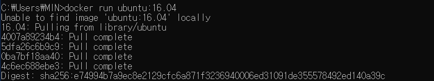
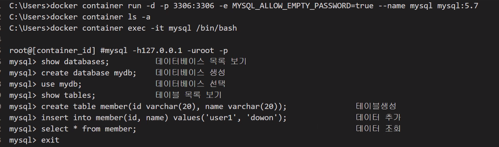
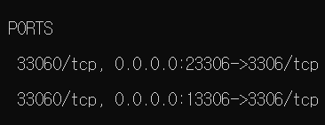

# 도커 정리

> 도커 명령어 정리

- **docker** container create ubuntu:16.04
  - 우분투 16.04 버전을 컨테이너로 새로 만든다(이미지 있을 경우에)
- **docker** container start <container id>
  - 해당 컨테이너id 실행

- **docker** container ls
  - 컨테이너 목록 형성

- **docker** container rm  <container id>
  - 컨테이너 id값 삭제

- **docker** run ubuntu:16.04
  - 이미지가 없으면 pull해서 실행까지 해놓는다
  - 
    - 이렇게
- 
  - 이미지/컨테이너가 없는 상태에서 컨테이너 런을 하게되면
  - it :interactive옵션/tele type write 인터렉티브한tty를 만들어서 터미널을 만들어놓고 쓰겠다.
  - bash shell을 쓰겠다
  - 
  - 이런 결과창이 뜬다! 컨테이너에 접속하게 되었음
    - exit를 누르면 종료된다

- **docker** container run ***-t*** ubuntu:16.04 /bin/bash
  - 터미널 옵션만 가지고 접속한다
  - 명령어 타이핑이 안됨
    - 이럴땐 ctrl+c

- **docker** container run ***-i*** ubuntu:16.04 /bin/bash
  - 여기엔 입력은 가능하다
  - 하지만 터미널로 명령이 전달되지 않는다
    - 이 때도 ctrl+c

- docker container rm -f <container id>
  - 강제삭제
  - 권하진 않는다

- docker container run --rm -it ubuntu:16.04 /bin/bash

  - 컨테이너가 스탑이 되면 자동으로 삭제된다

    

- docker container run -d -p 3306:3306 -e MYSQL_ALLOW_EMPTY_PASSWORD=true --name mysql mysql:5.7
  - docker: Error response from daemon: Conflict. The container name "/mysql" is already in use by container "83bcb0769f27671c2f7fd6fd94f34fce2942436171b3298253810500bb527867". You have to remove (or rename) that container to be able to reuse that name.
    - 하나는 포트 충돌/ 다른 하나는 이름 중복
    - 윈도우 검색에 서비스 앱 켜서 MySQL 을 찾아.-> 우클릭 속성 -> 시작 유형(E): (자동 -> 사용안함) -> 서비스 상태 중지
    - 
    - 여기 이름을 바꿔주거나
- exec 작동중인 컨테이너에 명령어 실행
- docker exec -it <container id> bin/bash
  - container id로 접속

- mysql -h127.0.0.1 -uroot -p
  - mysql 실행하면 무조건 루트폴더가 생긴다
- 현재 데이터베이스 시스템에 데이터가 얼마나 있는지 본다
  - show databases;

- docker container run -d -p 13306:3306 -e MYSQL_ALLOW_EMPTY_PASSWORD=true --name mysql mysql:5.7
- 같은 포트 사용하지 않도록 위와 아래처럼..sql 두 개를 만드려면 이렇게 로컬포트 번호를 다르게 해주면 된다

- docker container run -d -p 23306:3306 -e MYSQL_ALLOW_EMPTY_PASSWORD=true --name mysql_client mysql:5.7

- 한번에 mysql로 들어가기

