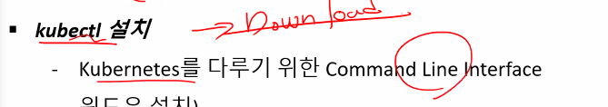
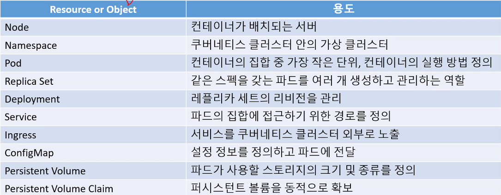
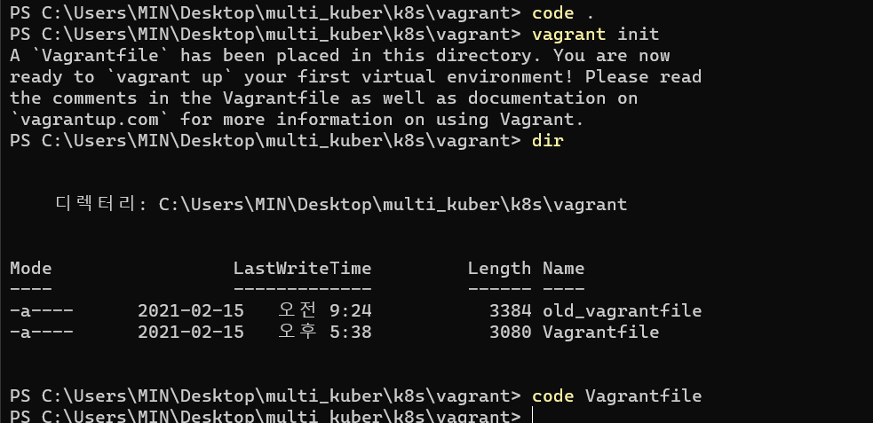
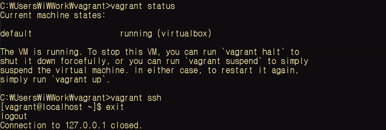

### kubectl get pods

- pods: 현재 설치되어있는 팟이 얼마나 있는지 확인
- 배포되기 위한 최소의 단위
- demon set/deplyment-replicaset/stateful/job/replica set 어쩌고 등으로 만들 수 있다
- 컨테이너를 담고 있는 그릇

쿠버네티스 명령어 처리cli 이름이 kubectl

### dashboard

- 보안에 취약해서 설치하는것 권장하지 않음
- 테스트 용도/쿠버네티스 초심자에게는 시각적으로 쿠버네티스가 어떻게 리소스를 관리하는지 보여주기때문에 ㄱㅊㄱㅊ
- kubectl apply -f https://

- kubectl proxy

교재 p.192

개별적인 작업단위들

dsl

vagrant status해서 멀티 클러스터링 확인해보자

